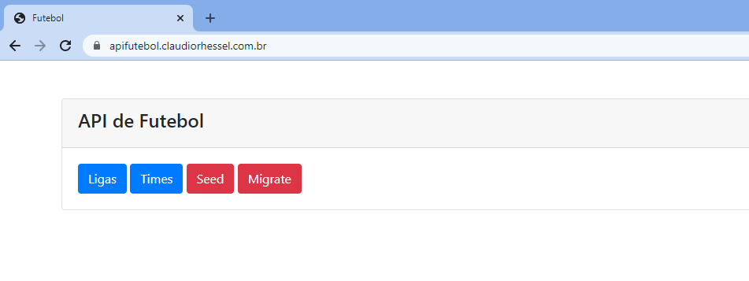

# apifutebol
Projeto para criação de CRUD e API que consome a api-football da RapidAPI

A intenção do projeto é se conectar a api-football da RapidAPI (https://rapidapi.com/api-sports/api/api-football), recuperar dados de ligas e times, após isso gravar as informação em um banco de dados MySQL.

Com os dados gravados no banco disponibilizar um CRUD para os dados e também um API RestFULL.

Este projeo ainda está em andamento e alguns itens ainda precisam ser implementados:

- Autenticação
- Autorização
- ACL
- Logs (acesso, ação)
- Middleware (possibilidar a utilização nas rotas)
- Requests e Resources
- Migrations e Seeders (o seeder atual é manual)
- Classe para o DAO (A atual é um código inserido não é carregado via autoload)

## Requisitos
PHP 7 ou superior
MySQL ou MariaDB
Ubuntu ou outra distribuição linux

## Instalação
O passo-a-passo para a intalação leva em consideração um ambinte Ubunto 22.04 rodando no WSL2 do Windows, já com o Apache2, PHP e MySQL instalados e funcionando.

Isso não e pré-requisito para funcionar, mas pode ser que erros aconteçam em ambientes diferentes.

Caso você queira ter uma instalação semelhante abaixo seguem alguns links que podem te ajudar a fazer esta configuração:

[https://github.com/codeedu/wsl2-docker-quickstart](https://github.com/codeedu/wsl2-docker-quickstart)

Primeiramente deve-se baixar o projeto em seu ambiente a partido do git:

```
~$bash git clone -b master https://github.com/claudiorhessel/apifutebol.git
```

Não utilizei qualque biblioteca ou dependência que precisa ser instalada para o sistema funcionar, a intenção do projeto e fazer todos os itens somente com PHP, Bootstrap e MySQL.

Depois criar um virtual host apontado para a raiz do projeto. Caso você não saiba como fazer isso favor visualizar o passo-a-passo do link abaixo:

[https://marcelo-albuquerque.medium.com/como-configurar-virtual-hosts-no-wsl-2-com-ubuntu-20-04-f9423829f3a6](https://marcelo-albuquerque.medium.com/como-configurar-virtual-hosts-no-wsl-2-com-ubuntu-20-04-f9423829f3a6)

Criar um banco de dados e colocar no arquivo que fica no caminho abaixo os dados de conexão para o banco de dados:

[https://github.com/claudiorhessel/apifutebol/blob/master/config/App.php](https://github.com/claudiorhessel/apifutebol/blob/master/config/App.php)

```
//config conexao
$host = 'localhost';
$banco = 'futebol';
$usuario = 'root';
$senha = 'root';
```
Também o arquivo abaixo:

[https://github.com/claudiorhessel/apifutebol/blob/master/config/config.php](https://github.com/claudiorhessel/apifutebol/blob/master/config/config.php)

```
define('DB_HOST', 'localhost');
define('DB_NAME', 'futebol');
define('DB_USER', 'root');
define('DB_PASS', 'root');
```

Utilizar o arquivo abaixo para criação do banco de dados:

[https://github.com/claudiorhessel/apifutebol/blob/master/database/create_tables.sql](https://github.com/claudiorhessel/apifutebol/blob/master/database/create_tables.sql)

Ou utilizar o botão "Migrate" da tela inicial.

Também deve-se utilizado o botão "Seed" da tela inicial para se baixar os dados da API externa e salvar no banco de dados.

Se tudo estiver corrigo conforme o esperado ao acessar a URL do projeto a tela inicial será exibida:



## APIs
Abaixo segue o link com o Export da Collection do Insomnia:
[https://github.com/claudiorhessel/apifutebol/blob/master/docs/api_futebol.json](https://github.com/claudiorhessel/apifutebol/blob/master/docs/api_futebol.json)


